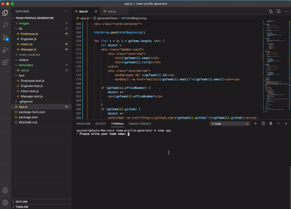
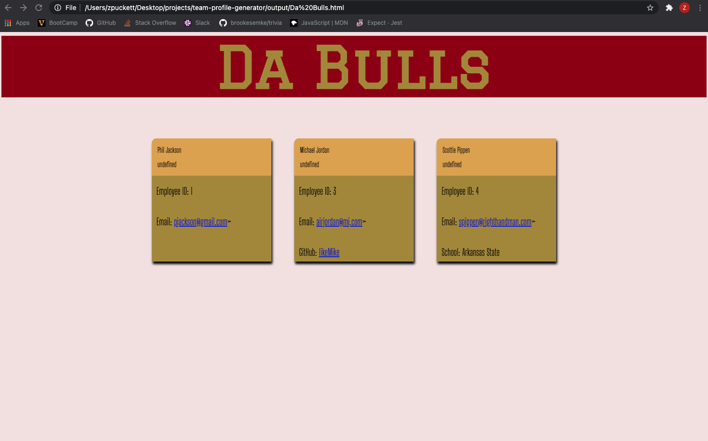
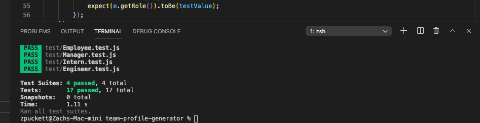

# Team-Profile-Generator

## Description 
This is a Node based application that collects input from user to create a detailed page of for a productions team. 

## Images

## Testing
This program was build using class syntax and constructor functions. The function for each employee type was tested before building out the rest of the program. 

## Installation 
Run node.js and perform an npm install to bring in all necesarry node modules. The application is run with the command "node app.js"
